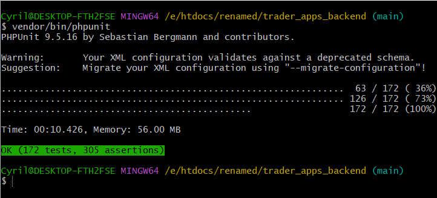

# Laravel Backend API for Ekumfi Juice Apps

This repository contains the Laravel backend API for a set of Ekumfi Juice Android apps. The API serves three distinct types of apps:
- [Ekumfi Juice Market App](https://github.com/cgardesey/EkumfiMarket)
- [Ekumfi Juice Wholesaler App](https://github.com/cgardesey/EkumfiWholesaler)
- [Ekumfi Juice Agent App](https://github.com/cgardesey/EkumfiAgent)
- [Ekumfi Juice Admin App](https://github.com/cgardesey/EkumfiAdmin)

## Requirements

To run this Laravel backend API, you need to have the following software installed:

- PHP (>= 7.4)
- Laravel (>= 5.x)
- MySQL (>= 8.0) or any other compatible database
- Composer (for dependency management)

## Installation

- Clone this repository to your local machine:
   ```shell
   git git@github.com:cgardesey/ekumfi_juice_backend.git
   
- Change into the project directory:
   ```shell
   cd ekumfi_juice_backend
- Install the project dependencies using Composer:
   ```shell
   Composer install
- Install JavaScript dependencies using npm:
   ```bash
      npm install  
- Create a copy of the .env.example file and rename it to .env:
  ```shell
  cp .env.example .env
- Generate a new application key:
  ```shell
   php artisan key:generate
- Configure your database settings in the .env file.
- Run the database migrations:
   ```shell
   php artisan migrate
- Start the development server:
   ```shell
   php artisan serve

- You should now be able to access the application at `http://localhost:8000`.


- Run all tests (unit and feature tests):

  ```bash
    # On Windows platform, run:
    vendor\bin\phpunit
  
    # On Unix-like platform, run:
    vendor/bin/phpunit 
All test should pass as shown:



## Deployment
To deploy this application to a production server, follow these steps:
- Set up a production-ready web server (e.g., Nginx, Apache).
- Configure your web server to point to the public directory.
- Update the .env file with production-specific settings.
- Ensure your server meets the PHP and database requirements.

## Contributing

If you'd like to contribute to this project, please follow these steps:

- Fork the repository on GitHub.
- Create a new branch with a descriptive name.
- Commit your changes to the new branch.
- Push the branch to your forked repository.
- Submit a pull request to the original repository.

Please ensure that your code follows the project's coding standards and includes appropriate tests for any new functionality.

## License

Trader-apps-backend project is licensed under the [MIT License](https://opensource.org/licenses/MIT). Feel free to use it as a reference or starting point for your own projects.
